## 概念介绍

### [官方介绍：]（https://www.webpackjs.com/concepts/）

Webpack 是一个现代 JavaScript 应用程序的静态模块打包器（module bundler）。当 webpack 处理应用程序时，它会递归地构建一个依赖关系图（dependency graph），其中包含应用程序需要的每个模块，然后将所有这些模块打包成一个或多个 bundle。

### entry (入口)

入口指的是 webpack 在构建项目的时候的构建起点，默认值是 ./src/index.js，你可以通过配置指定不同的入口文件。

单个入口文件

```js
module.exports = {
  entry: './src/file.js'
}
```

多个入口文件

```js
module.exports = {
  entry: ['./src/file_1.js', './src/file_2.js']
}
```

对象语法

```js
module.exports = {
  entry: {
    app: './src/app.js',
    adminApp: './src/adminApp.js'
  }
}
```

### output (输出)

有入口就有输出，指的是打包完成后输出文件的位置。

单个输出文件

```js
module.exports = {
  output: {
    filename: 'bundle.js'
  }
}
```

多个输出文件

```js
module.exports = {
  entry: {
    app: './src/app.js',
    search: './src/search.js'
  },
  output: {
    filename: '[name].js',
    path: __dirname + '/dist'
  }
}
// 写入到硬盘：./dist/app.js, ./dist/search.js
```

### loader（加载器）

用于对于资源的源代码进行转换，常见的比如将 TypeScript 转换为 JavaScript 或将内联图像转换为 data URL 等等。

loader 的特点：

1. loader 支持链式调用。
2. loader 可以是同步的，也可以是异步的。
3. loader 运行在 Node.js 中，并且能够执行任何操作。

常见的 loader

1. babel-loader 使用 Babel 加载 ES2015+ 代码并将其转换为 ES5
2. esbuild-loader 加载 ES2015+ 代码并使用 esbuild 转译到 ES6+
3. ts-loader 像加载 JavaScript 一样加载 TypeScript 2.0+
4. markdown-loader 将 Markdown 编译为 HTML
5. style-loader 将模块导出的内容作为样式并添加到 DOM 中
6. css-loader 加载 CSS 文件并解析 import 的 CSS 文件，最终返回 CSS 代码
7. less-loader 加载并编译 LESS 文件
8. sass-loader 加载并编译 SASS/SCSS 文件
9. postcss-loader 使用 PostCSS 加载并转换 CSS/SSS 文件
10. vue-loader 加载并编译 Vue 组件

```js
module.exports = {
  module: {
    rules: [
      { test: /\.css$/, use: 'css-loader' },
      { test: /\.ts$/, use: 'ts-loader' }
    ]
  }
}
```

### plugin（插件）

插件目的在于解决 loader 无法实现的其他事。Webpack 提供很多开箱即用的插件。

```js
const HtmlWebpackPlugin = require('html-webpack-plugin')
module.exports = {
  plugins: [
    new HtmlWebpackPlugin({ template: './src/index.html' }) // 指定打包前使用的html模版
  ]
}
```

### Mode(模式)

webpack 中提供了三种模式的配置，分别是 prodction，development 和 none，对于不同的模式配置，webpack 会会进行不同的内置优化。

```js
module.exports = {
  mode: 'development'
}
```

## 文件夹说明

1. 01-init 文件（初始化一个项目并完成打包和启动服务） ===> 第一步 至 第六步
2. 02-file（拆分不同环境下的 webpack 文件配置） ===> 第七步
3. 03-minimizer（提取 css 文件，压缩 css 文件和 js 文件） ===> 第八步
4. 04-asset（配置不同的资源模块（asset/modules）） ===> 第九步

## 实践之旅

### 第一步：创建一个文件夹，并初始化目录 npm init -y

### 第二步：安装 webpack 相关包，npm install webpack webpack-cli webpack-dev-server --save-dev

1. webpack：webpack 的是核心包。
2. webpack-cli：是一个命令行接口（CLI）工具，它提供了通过命令行运行 webpack 的方式。
3. webpack-dev-server：是一个小型的 Express 服务器，它使用 webpack-dev-middleware 来服务于 webpack 的包。可以实现实时加载。

### 第三步：文件夹的创建 && 插件安装

1. 在根目录下创建 src 文件夹，并在 src 文件夹下创建 index.js 文件用于 webpack 打包的入口文件
2. 在根目录下创建 index.html 文件，用于 webpack 打包的模版文件
3. 安装 html-webpack-plugin 插件(用于打包 html 文件) npm install html-webpack-plugin --save-dev

### 第四步：在根目录下创建 config 文件夹，在 config 文件夹下创建 webpack.config.js(用于配置 webapck) 下面是一个简单的 webpack.config.js 配置

```js
const path = require('path')
const htmlWebpackPlugin = require('html-webpack-plugin') //引入
module.exports = {
  entry: './src/index.js', //需要打包文件的入口路径
  output: {
    filename: 'bundle.js', //打包后文件的名称
    path: path.resolve(__dirname, '../dist'), //打包后文件的输出路径
    clean: true // 清理打包后上次遗留的js和html文件
  },
  mode: 'none',
  plugins: [
    //配置打包后的html文件
    new htmlWebpackPlugin({
      template: './index.html' //指定打包前使用的html模版
      // filename:'index.html',  //打包后的html文件名
      // inject:'body'   //这里指的是将打包后的script标签添加的位置
    })
  ]
}
```

### 第五步：配置 package.json 中的 scripts 命令，并在终端中执行 npm run build，这个时候就可以看到根目录下的 dist 文件夹，这就是打包后的文件。

```json
  "scripts": {
    "test": "echo \"Error: no test specified\" && exit 1",
    "build": "webpack -c ./config/webpack.config.js",
  },
```

### 第六步：启动项目，实现实时重载功能。

1. 在 webpack.config.js 中添加如下代码。

```js
module.exports = {
  devServer: {
    open: true, // 启动项目的同时自动打开浏览器
    host: 'localhost', // 设置服务器主机地址
    port: 3000, // 设置服务器端口
    hot: true // 开启热模块替换
  }
}
```

2. 在 package.json 文件中添加运行的脚本，在终端中启动脚本 npm run dev

```json
  "scripts": {
    "test": "echo \"Error: no test specified\" && exit 1",
    "dev": "webpack serve -c ./config/webpack.config.js",
    "build": "webpack -c ./config/webpack.config.js"
  },
```

### 第七步：根据不同的环境变量加载不同配置文件

1. 拆分文件，在 config 中新建三个文件，分别是 webpack.dev.config.js、webpack.prod.config.js、webpack.common.config.js；
2. 更改 package.json 文件，增加 --mode=development --node-env=development 如下

```json
 "scripts": {
    "test": "echo \"Error: no test specified\" && exit 1",
    "dev": "webpack serve -c ./config/webpack.config.js --mode=development --node-env=development",
    "build": "webpack -c ./config/webpack.config.js --mode=production --node-env=production"
  },
```

解释：--node-env=development 是什么？ 这里的 --node-env 是 node 中提供设置 NODE_ENV 环境变量的方式，当启动项目的时候，可以通过 process.env.NODE_ENV 拿到当前的环境变量。process.env.NODE_ENV 是 Node.js 环境中的一个非常重要的全局变量，用于确定 Node.js 应用程序的运行环境。process 是 Node.js 的一个全局对象，提供当前 Node.js 进程的有关信息以及控制进程的能力。而 env 是 process 对象的一个属性，它包含了用户环境的信息，即操作系统级别的环境变量。

解释：--mode=development 是 webpack 中用于指定当前的构建模式，可以通过 webpack.config.js 文件中导出的函数中的参数获取；具体可见 [webpack 官网](https://www.webpackjs.com/configuration/mode#root)； 这里我们设置一种即可。

3. 下载 webpack-merge 插件，npm install webpack-merge --save-dev 并合并不同的配置文件。
   解释：webpack-merge 介绍：webpack-merge 插件是用于将多个 webpack 配置文件合并成一个配置文件，这样可以在不同的环境下共享和重用配置。

拆分后的 webpack.config.js

```js
const { merge } = require('webpack-merge')
const common = require('./webpack.common.config')
const dev = require('./webpack.dev.config')
const prod = require('./webpack.prod.config')
module.exports = (env, argv) => {
  switch (process.env.NODE_ENV) {
    case 'production':
      return merge(common, prod)
    case 'development':
      return merge(common, dev)
    default:
      return new Error('no found')
  }
}
console.log(9999, process.env.NODE_ENV)
```

拆分后的 webpack.dev.config.js

```js
module.exports = {
  mode: 'development' //将mode设置成开发环境
}
```

拆分后的 webpack.prod.config.js

```js
module.exports = {
  mode: 'production' //将mode设置成生产环境
}
```

拆分后的 webpack.common.config.js

```js
const path = require('path')
const htmlWebpackPlugin = require('html-webpack-plugin') //引入
module.exports = {
  entry: './src/index.js', //需要打包文件的入口路径
  output: {
    filename: 'bundle.js', //打包后文件的名称
    path: path.resolve(__dirname, '../dist'), //打包后文件的输出路径
    clean: true // 清理打包后上次遗留的js和html文件
  },
  plugins: [
    //配置打包后的html文件
    new htmlWebpackPlugin({
      template: './index.html' //指定打包前使用的html模版
      // filename:'index.html',  //打包后的html文件名
      // inject:'body'   //这里指的是将打包后的script标签添加的位置
    })
  ],
  devServer: {
    open: true, // 启动项目的同时自动打开浏览器
    host: 'localhost', // 设置服务器主机地址
    port: 3000, // 设置服务器端口
    hot: true // 开启热模块替换
  }
}
```

4. 拆分完成后，在终端输入 npm run dev, 显示如下则配置完成。
   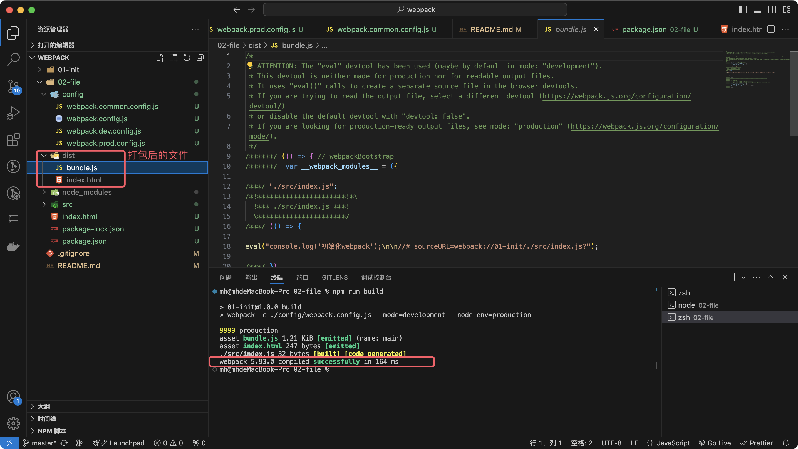

5. 拆分完成后，在终端输入 npm run build, 显示如下则配置完成。
   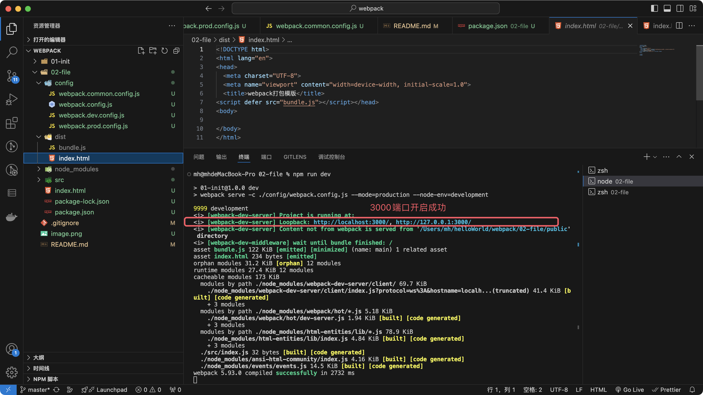

### 第八步：提取 css，压缩 css 和 js 文件

1. 在 style 文件夹下新建一个 css 文件，并添加相应的样式。

```css
.box {
  background-color: pink;
  width: 100px;
  height: 100px;
}
```

2. 在 style 文件夹下新建一个 less 文件，并添加相应的样式。

```less
@color: #726d6d;

body {
  background-color: @color;
}
```

3. 在 index.js 文件夹下添加如下代码。

```js
import './style/index.css'
import './style/index.less'
/**
 * 向body中插入一个div
 */
var box = document.createElement('div') // 创建一个div标签
box.classList.add('box') // 添加div的class
document.body.appendChild(box) // 向body中添加一个dev
```

4. 下载解析 less，css，style 相应的 loader，npm install style-loader css-loader less-loader --save-dev

5. 在 webpack.dev.config.js 文件做如下配置：

```js
module.exports = {
  mode: 'development', //将mode设置成开发环境
  module: {
    rules: [
      //配置loader
      {
        test: /\.(css|less)$/,
        use: ['style-loader', 'css-loader', 'less-loader']
      }
    ]
  }
}
```

- style-loader 功能：style-loader 的作用是将 css 样式动态的注册到 HTML 的 style 标签中。并将 css 写入这个标签内。在 index.js 文件中引入了两个 css 文件和一个 less 文件，最后都被解析成相应的 style 标签。 [官方详解](https://www.webpackjs.com/loaders/style-loader/#root)

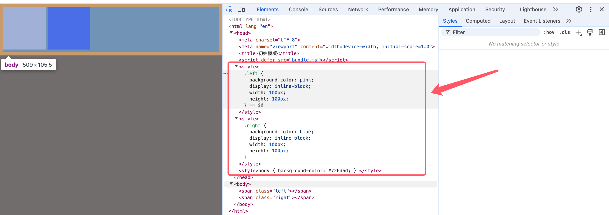

- css-loader 功能：
  3.1、解析 CSS 文件中的 @import 和 url() 语句
  3.2、将 CSS 转换为 CommonJS 模块
  3.3、支持 CSS Modules
  3.4、[官方详解](https://www.webpackjs.com/loaders/css-loader#root)

- less-loader 功能：将 less 文件编译成 css 文件 [官方详解](https://www.webpackjs.com/loaders/less-loader/)

5. 下载 mini-css-extract-plugin 插件 npm install mini-css-extract-plugin --save-dev, 在 webpack.prod.config.js 文件做如下配置：

```js
const MiniCssExtractPlugin = require('mini-css-extract-plugin')
module.exports = {
  mode: 'production', //将mode设置成生产环境
  module: {
    rules: [
      //配置loader
      {
        test: /\.(css|less)$/,
        use: [MiniCssExtractPlugin.loader, 'css-loader', 'less-loader']
      }
    ]
  },
  plugins: [
    //抽离css文件
    new MiniCssExtractPlugin({
      filename: 'style/[contenthash].css'
    })
  ]
}
```

解释：mini-css-extract-plugin 插件用于生产环境中， mini-css-extract-plugin 插件会将 CSS 提取到单独的文件中，为每个包含 CSS 的 JS 文件创建一个 CSS 文件，并且支持 CSS 和 SourceMaps 的按需加载。 [官方详解](https://www.webpackjs.com/plugins/mini-css-extract-plugin/#root)。

6. 在终端中打包一下生产环境，npm run build ，这个时候可以看到三个 css 文件被打包成了一个 css 文件，如图：
   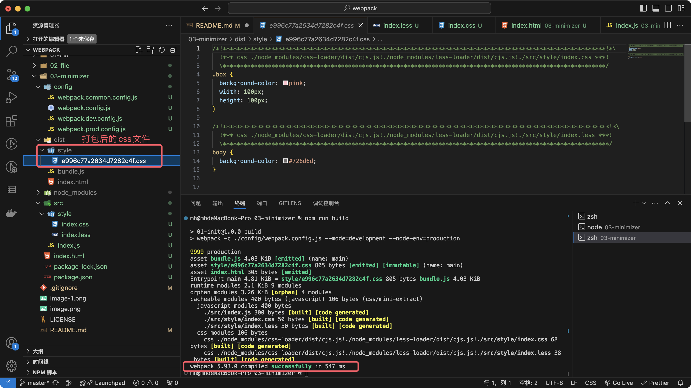

6、此时可以运行一下 index.html,看下在浏览器中样式是否加载成功。
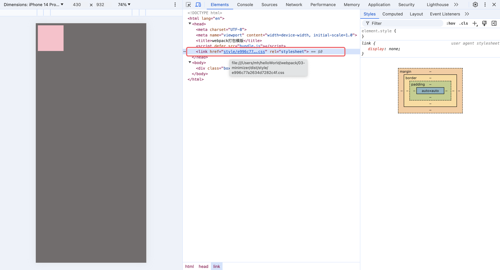

7、这里生产环境使用 mini-css-extract-plugin 插件有以下几点好处。
7.1、加载优化：由于 mini-css-extract-plugin 可以将 css 和 js 进行分析，这样在加载的过程中可以并行加载，提出页面的加载速度。
7.2、按需加载：这意味着只有当前的路由和组件 css 发生变化的时候才会去重新被加载，加载的颗粒度更小。
7.3、支持 Source Maps：支持在开发过程中调试样式，但一般我们会在开发环境中使用 style-loader，因为 style-loader 会比 mini-css-extract-plugin 的加载速度更快，但是两者不可同时使用。

8、 虽然生产环境中的 css 文件被合并到了一个文件，但是文件并没有被压缩，所以需要对生产环境中的 css 进行压缩处理.
8.1、在终端中执行 npm install css-minimizer-webpack-plugin --save-dev
8.2、在 webapck.prod.config.js 文件中引入 css-minimizer-webpack-plugin 插件并使用它。

```js
const CssMinimizerPlugin = require('css-minimizer-webpack-plugin')
module.exports = {
  optimization: {
    minimizer: [
      new CssMinimizerPlugin() // 添加 CSS 压缩插件
    ]
  }
}
```

9、同理对于 js 的压缩安装 terser-webpack-plugin ; 终端命令：npm install terser-webpack-plugin --save-dev

```js
const TerserPlugin = require('terser-webpack-plugin')
module.exports = {
  optimization: {
    minimizer: [
      new TerserPlugin() // 该插件使用 terser 来压缩 JavaScript。
    ]
  }
}
```

10、终端中输入 npm run build 就可以看到打包后的文件。
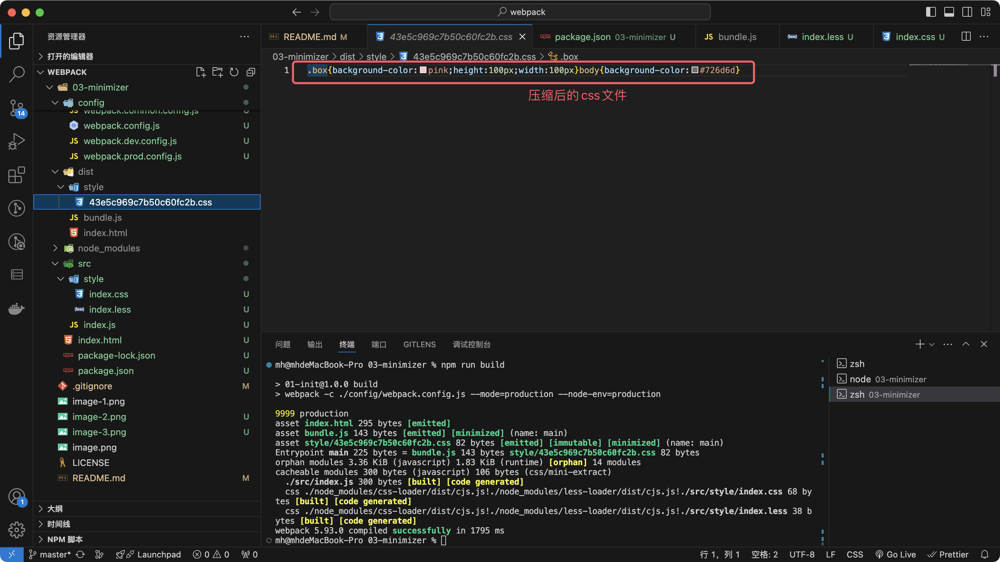

## 第九步：配置不同的资源模块（asset/modules）

Webpack 5 中新增了资源模块（Asset Modules），这些模块旨在简化对静态资源（如图片、字体、视频等）的处理，而无需再像 Webpack 4 及以前版本那样依赖额外的 loader（如 file-loader、url-loader、raw-loader）。Webpack 5 的资源模块主要包括以下几种类型，它们之间的主要区别如下：

资源准备：

1. 在 src 文件夹下面新建一个 images 文件夹用于存放图片资源（网上找的 3 张不同格式的图片作为演示）；

注意事项：上面的在打包图片之前，在 js 文件中已经引入了资源图片，如果没有引入，执行打包时资源不会被打包。

```js
/**
 * @index.js文件
 * 处理不同的图片
 */
import pngSrc from './components/images/img-01.png'
import jpegSrc from './components/images/img-02.jpeg'
import gifSrc from './components/images/img-03.gif'

let srcs = [pngSrc, jpegSrc, gifSrc]
var div = document.createElement('div') // 创建一个div标签
div.classList.add('imageList') // 添加div的class
srcs.forEach(item => {
  const img = document.createElement('img')
  img.src = item
  div.appendChild(img)
})
document.body.appendChild(div)
```

说明：下面的改动都是在 webpack.common.config.js 文件中配置

2. asset/resource
   功能：将资源分割为单独的文件，并导出该文件的 URL。这类似于 Webpack 4 中的 file-loader 的功能。

   使用场景：适用于那些较大的资源文件，如图片、视频等，这些文件通常不会内联到 JavaScript 文件中，而是作为外部资源被引用。

```js
module.exports = {
  module: {
    rules: [
      {
        test: /\.(png|svg|jpg|jpeg|gif)$/i,
        type: 'asset/resource',
        generator: {
          filename: 'images/[name].[hash:8][ext]'
        }
      }
    ]
  }
}
```

配置完成后，重新打包项目，可以看到在 dist 目录下生成了一个新的 images 文件夹，并导入了打包前图片资源的 URL。
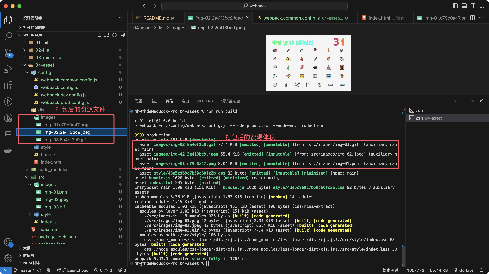

3. asset/inline
   功能：将资源导出为 DataURL（即 base64 编码的字符串）的形式，并内联到 JavaScript 文件中。这类似于 Webpack 4 中的 url-loader 的功能，但更加集成和简化。

   使用场景：适用于较小的资源文件，如小图标、小图片等，这些文件可以直接内联到 JavaScript 文件中，以减少 HTTP 请求次数。

```js
module.exports = {
  module: {
    rules: [
      {
        test: /\.(png|svg|jpg|jpeg|gif)$/i,
        type: 'asset/inline'
      }
    ]
  }
}
```

配置完成后，重新打包项目，可以看到在 dist 目录下生成了一个 js 文件，js 文件的体积是 202KiB。
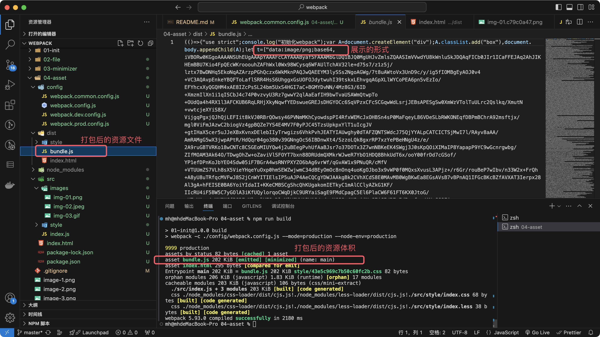

4. asset/source
   功能：将资源导出为源代码（source code）的形式。这类似于 Webpack 4 中的 raw-loader 的功能，但同样更加集成和简化。

   使用场景：适用于那些需要直接以文本形式被 JavaScript 使用的资源，如 SVG 文件的源代码、CSS 文件等。

```js
module.exports = {
  module: {
    rules: [
      {
        test: /\.(png|svg|jpg|jpeg|gif)$/i,
        type: 'asset/source'
      }
    ]
  }
}
```

配置完成后，重新打包项目，可以看到在 dist 目录下生成了一个 js 文件，js 文件的体积是 294KiB，这种打包后的体积比 asset/inline 的打包类型体积更大的。

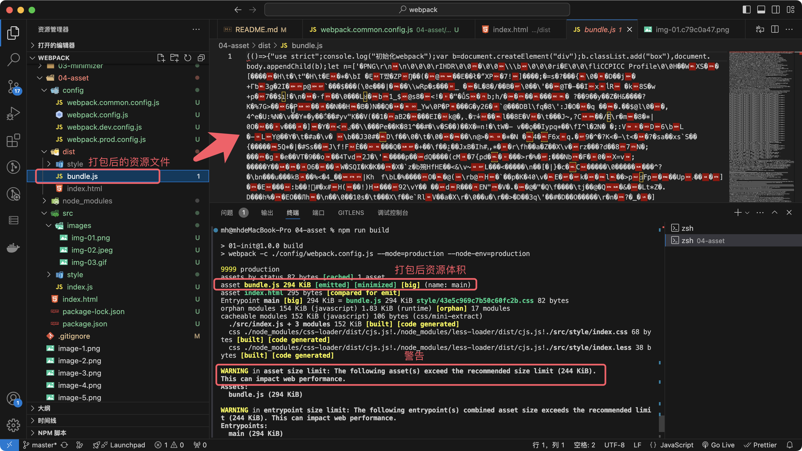

5. asset
   功能：自动选择将资源导出为 DataURL 还是单独的文件，这取决于资源的体积大小。默认情况下，Webpack 会将小于 8KB 的资源内联为 DataURL，大于 8KB 的资源则作为单独的文件处理。这类似于 Webpack 4 中配置过 limit 的 url-loader 的功能。

   使用场景：适用于那些需要自动根据资源大小选择处理方式的场景，既能够减少小资源的 HTTP 请求次数，又能够避免大资源内联导致的 JavaScript 文件体积过大。

```js
module.exports = {
  module: {
    rules: [
      {
        test: /\.(png|svg|jpg|jpeg|gif)$/i,
        type: 'asset',
        parser: {
          dataUrlCondition: {
            maxSize: 10 * 1024 // 自定义大小限制
          }
        }
      }
    ]
  }
}
```

配置完成后，重新打包项目，可以看到在 dist 目录下生成了一个 js 文件和两个 images 资源，这里的三张图片中有一张体积小于 10 KB 的图片被打包进了 js 文件中，其余两张采用 asset/resource 的方式进行打包
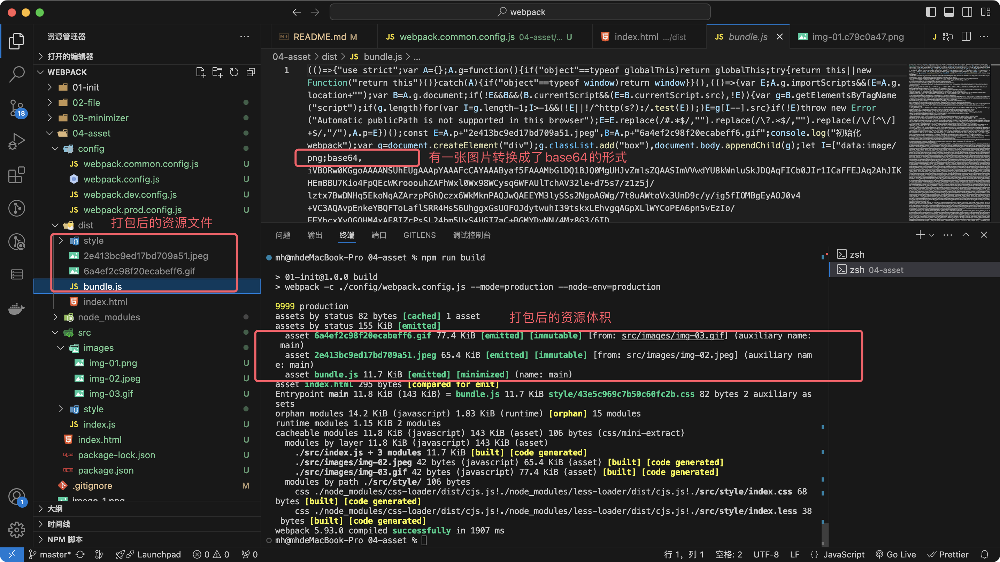

总结：asset/resourc 方式适合体积较大的资源进行打包，比如大图片、音视频等。 asset/inline 适合较小的资源进行打包，比如小图标、小图片等。asset/source 导出的是源代码，适合 svg 资源进行打包。asset 会根据资源的体积进行不同方式的打包处理。

## 第十步：第三方组件库引入优化

### 使用 lodash 作为优化的案例：

#### 解构引入：

1. 执行 npm 命令： npm install lodash (目前我使用的版本是^4.17.21)

2. 在项目中解构引入，并使用其中一个函数。

```js
import { chunk } from 'lodash'
console.log(chunk(['a', 'b', 'c', 'd'], 2)) // 在项目中使用chunk方法
```

3. 执行 npm 命令： npm run build 。webpack 打包完成后可以看出体积是 69.4k，这个体积是经过压缩后的，没有压缩的体积是 200 多 k。 这里我们只使用了 webpack 中的一个方法，但是打包的过程中却把整个 lodash 文件都打包了进来，显然这不是我们想要的。
   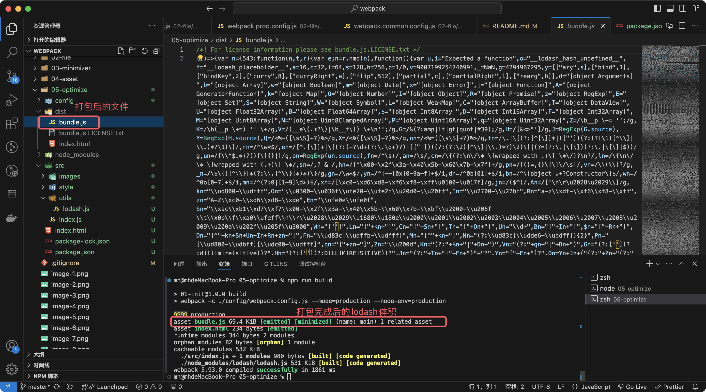

#### 具体文件引入：

1. 上面结构的方式引入 lodash 打包的过程中会把整个 lodash 文件进行打包，如果使用具体文件具体打包的方式呢？

2. 在项目中具体文件具体引入，引入方式如下：

```js
import chunk from 'lodash/chunk'
console.log(chunk(['a', 'b', 'c', 'd'], 2)) // 在项目中使用chunk方法
```

3. 执行 npm 命令： npm run build。此时可以看出打包后的 lodash 的体积明显变小了很多，只有 3.6k，因为这里我们只使用了 lodash 的一个方法，并不需要把整个 lodash 都打包到项目中，虽然这种写法可以实现 webpack 的按需打包，但是奈何写法比较繁琐，有没有什么办法既可以实现使用解构的写法，同时打包的时候根据使用到的方法按需打包呢？为此 Babel 提供了一个插件 babel-plugin-lodash，用于优化项目中 Lodash 库的使用。通过仅导入 Lodash 中实际使用的函数，而不是整个库，它可以显著减少最终打包文件的大小。具体使用参考下面的 babel-plugin-lodash 的使用
   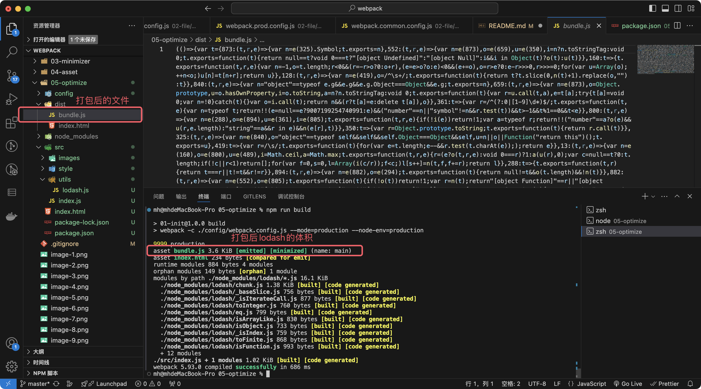

#### 使用 babel-plugin-lodash 优化 lodash

1. 安装 babel-plugin-lodash。执行命令： npm install --save-dev babel-plugin-lodash babel-loader @babel/preset-env

babel-plugin-lodash ==> 由于优化 lodash 的导入。 具体可参考: [babel-plugin-lodash 官网](https://www.npmjs.com/package/babel-plugin-lodash)
@babel/preset-env ==> 可以根据你的目标环境自动配置 Babel 插件
babel-loader ==> 允许你使用 Babel 和 webpack 一起工作

2. 修改 lodash 的引入方式。

```js
import { chunk } from 'lodash'
console.log(chunk(['a', 'b', 'c', 'd'], 2)) // 在项目中使用chunk方法
```

3. 修改 webpack.prod.config.js 的配置文件。

```js
module.exports = {
  module: {
    rules: [
      {
        test: /\.m?js$/, // 匹配 .js 和 .jsx 文件
        exclude: /(node_modules)/, // 排除 node_modules 目录
        use: {
          loader: 'babel-loader',
          options: {
            plugins: ['lodash'], // 使用 babel-plugin-lodash
            presets: ['@babel/preset-env'] // 使用 @babel/preset-env 预设
          }
        }
      }
    ]
  }
}
```

4. 执行 npm 命令： npm run build。此时可以看出打包后的 lodash 的体积明显变小了很多，只有 3.6k，同时又可以使用 解构的方式导入文件，是不是一举两得哈....
   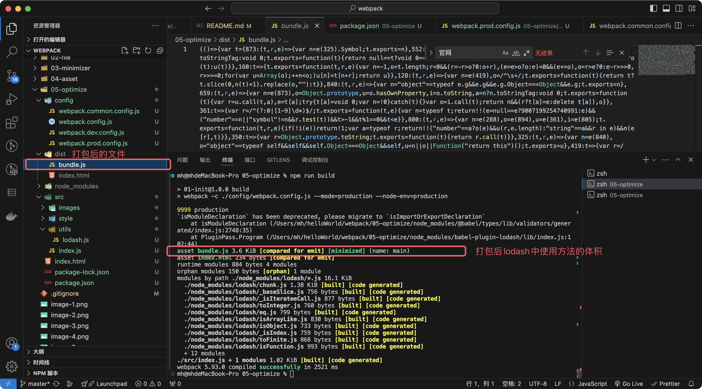

#### 使用 lodash-es 引入：

1. 执行 npm 命令： npm install lodash-es (目前我使用的版本是^4.17.21)

2. 在项目中解构引入，并使用其中一个函数。

```js
import { chunk } from 'lodash-es'
console.log(chunk(['a', 'b', 'c', 'd'], 2)) // 在项目中使用chunk方法
```

3. 执行 npm 命令： npm run build 。webpack 打包完成后可以看出体积是 2.49k，这是因为 lodash-es 是 lodash 官方提供的一个 es module 版本，它是支持 Tree Shaking 的，所以打包完后会自动的将没有使用 lodash 代码移除了。
   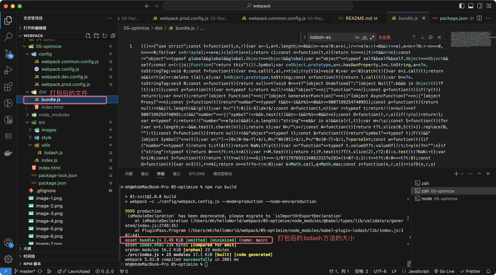

### 总结：

如果你在项目足够大，或者使用 lodash 的地方非常多，那么采用插件带来的优化已经不够明显了， 如果你的项目中 lodash 已经使用了解构的形式，那么采用 babel-plugin-lodash 进行优化是一个不错的选择，同时你也可以 lodash-es 的方式，安装后在业务代码中全局替换即可。 在此说下，如果你的项目中使用了 lodash-webpack-plugin，那么需要注意下 lodash-webpack-plugin 可能会带来意想不到的 bug，对于 lodash-webpack-plugin 详细的介绍可以参考这篇文章：[推荐文章](https://segmentfault.com/a/1190000045016962)

## 第十一步：webpack 跨域解决方案 (这里有问题)

### 如何快速本地搭建一个服务
